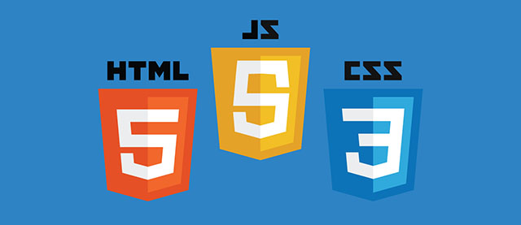

# Html5 Template

## Installation

Before running any Gulp tasks:

1. Check out this repository
2. Ensure you have **node** installed
3. Run `npm install` and `bower install` in the root directory

## Project Structure

The project ships with a directory structure like:

    /html5Template
    |---- /app
        |     |---- /favicon
        |     |---- /fonts
        |     |---- /img
        |     |---- /jade
        |     |     |---- /common
        |     |     |      |---- /head.jade
        |                  | ...
        |     |     |---- /pages
        |     |     |      |---- /index.jade
        |                  | ...
        |     |     |---- /layout.jade
        |     |---- /js
        |     |     |---- script1.js
        |           | ...
        |     |---- /sass
        |     |     |---- common.scss
        |           | ...
        |     |---- /sprite
        |     |---- index.jade
        |     |---- app.js
        |     |---- /scss
        |     |     |---- app.scss
        |           ...
        |     |---- /sprite
        |     |     |---- icon1.jpg
        |           ...
    |---- package.json
    |---- bower.json
    |---- gulpfile.js
    |---- (/dev)
    |---- (/prod)

## Gulp Tasks

All of the following are available from the command line.

* Gulp
* Bower
* Browser-sync
* Styles: Sass, Autoprefixer, Normalize.css
* JS: Jquery 1.8, modernizer 2.8.3, jquery-placeholder, bPopup, jquery-validate
* Jade
* Sprite with gulp.spritesmith
* Fonts copy
* Images copy
* Favicon generation with gulp-real-favicon

### Essential ones

These tasks I use as part of my regular developments and deploy scripts:

- __`gulp build-dev`__ Clean, build to the dev environment ('dev' folder).
- __`gulp build-prod`__ Clean, build to the prod environment ('prod' folder). All minifications included.
- __`gulp`__ Default task builds for dev and start Browser Sync (port:9000), watch changes.
